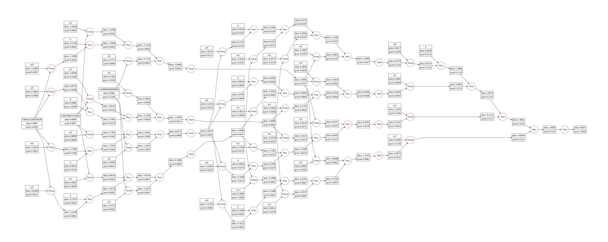

# Bytegrad


An implementation of the scalar valued type in Kotlin, that can support gradient descent based on
[micrograd](https://github.com/karpathy/micrograd).

> NOTE: Completed implementing the MLP (Multi Layer Perceptron). Next step: Gradient descent.

Here is an example DAG for an MLP that can be implemented as:

```kotlin
fun buildMLP(): BufferedImage {
    val size = 3
    val mlp = MLP(inputs = 3, layerSizes = listOf(4, 4, 1))
    val values = List(size) { nextValue(from = 1.0, until = 5.0) }
    val output = mlp(x = values)[0]
    output.zeroGrad()
    output.backwardPass()
    val graph = output.renderAsGraph()
    return graph.toFile(FileType.PNG).inputStream().use {
        ImageIO.read(it)
    }
}
```



## References

* [The spelled-out intro to neural networks and backpropagation](https://www.youtube.com/watch?v=VMj-3S1tku0)
