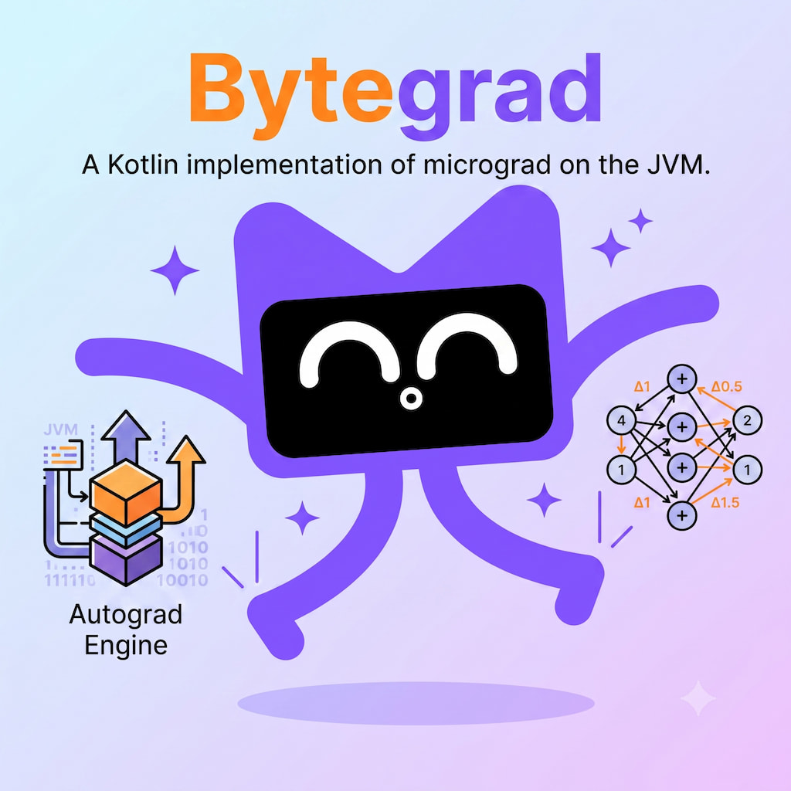

# Bytegrad

An implementation of the scalar valued type in Kotlin, that can support gradient descent based on
[micrograd](https://github.com/karpathy/micrograd).

> NOTE: This project is work-in-progress.

## References

* [The spelled-out intro to neural networks and backpropagation](https://www.youtube.com/watch?v=VMj-3S1tku0)
